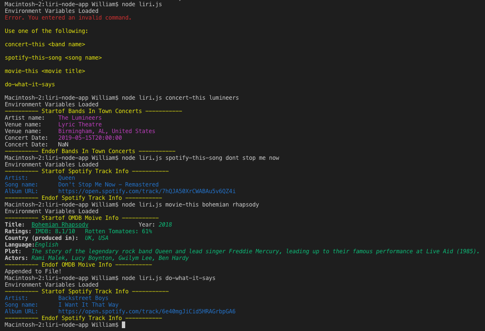

# LIRI #
###Language Interpretation and Recognition Interface.

This Node.js command line interface (CLI) App was designed to allow users a quick way to find information about concerts, songs, and movies. 

Instructions:

1. Since this app uses environment variable, you will first need to create a .env file and add your own API credentials for the following: 

* SPOTIFY_ID= _your id_
* SPOTIFY_SECRET= _your secret_
* BANDS_IN_TOWN= _your id_
* OMDB= _your key_

2. Next, install Node.js dependecies by running _npm i_ from the app's root directory.
3. To run the app, call _node liri.js_ followed by a space, the search type (or command), and if a search term is require, another space then the search term. For example:  _node liri.js concert-this lumineers_ 
4. The search terms (command) are:

* concert-this _band name_

* spotify-this-song _song name_

* movie-this _movie title_

* do-what-it-says

###Node Packages
* node-spotify-api
* colors
* axios
* dotenv
* fs 

<Bonus
I added inquirer to give user list of command options if they didn't input CLI arguments. >
