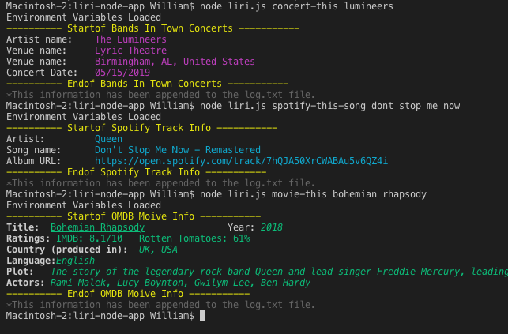
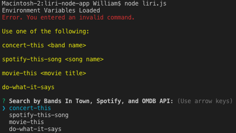
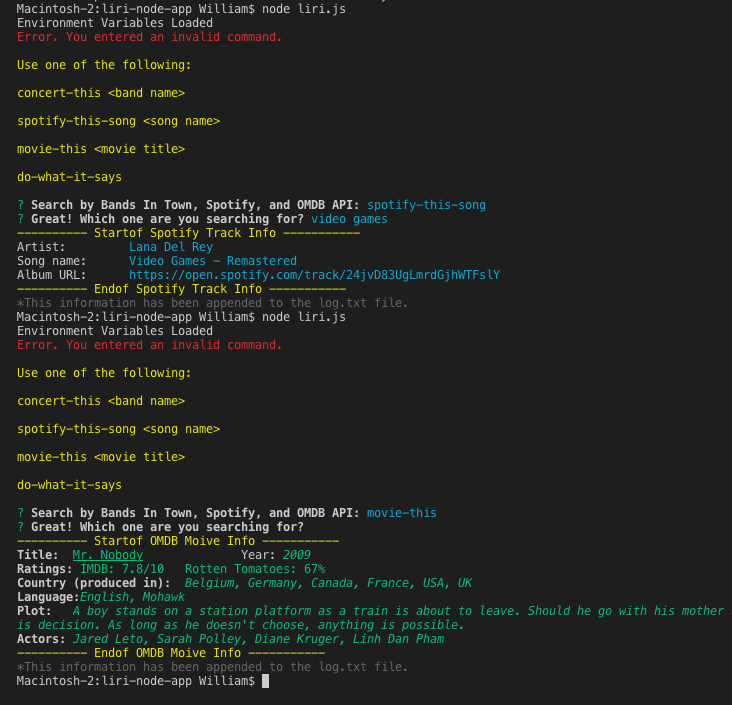
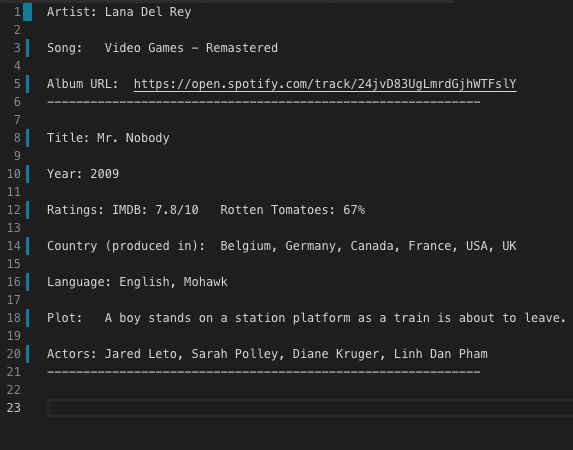

# LIRI #
###Language Interpretation and Recognition Interface.

This Node.js command line interface (CLI) App was designed to allow users a quick way to find information about concerts, songs, and movies. 

Instructions:

1. Since this app uses environment variable, you will first need to create a .env file and add your own API credentials for the following: 

* SPOTIFY_ID= _your id_
* SPOTIFY_SECRET= _your secret_
* BANDS_IN_TOWN= _your id_
* OMDB= _your key_

2. Next, install Node.js dependecies by running _npm i_ from the app's root directory.
3. To run the app, call _node liri.js_ followed by a space, the search type, and if a search term is require, another space followed by the search term. For example:  _node liri.js concert-this lumineers_ , where _concert-this_ is your search type and _lumineers_ is your search term.
4. The possible search terms are:

* concert-this _band name_

* spotify-this-song _song name_

* movie-this _movie title_

* do-what-it-says

The search type _do-what-it-says_ use the built-in fs (filesystem) node package's synchronous readFileSync method to read the random.txt file in the local directory. The file contains a concatenated search type and term separated by a comma. In our example, the file contains: _spotify-this-song,"I Want it That Way"_. The returned string is parsed and the values are passed and handle by the app.

###Node Packages
* node-spotify-api
* colors - bonus package
* axios
* dotenv
* fs 
* moment
* inquirer - bonus package

###Bonus Feature - Inquirer 

I added inquirer to give user list of search type options if they didn't input CLI arguments. This inquirer prompt only appears if the user doesn't enter a valid search type.

After the user selects a search type from the given list, an input prompt follows that asks the user to specify the song, concert or movie they wish to search. If no input is received, a pre-set default term is provided. In this case, the film Mr. Nobody is presented to the user as the result.

### Log.txt 

All search results are added and saved to the log.txt. The built-in fs (filesystem) node package is used for appending the new results to the file.

